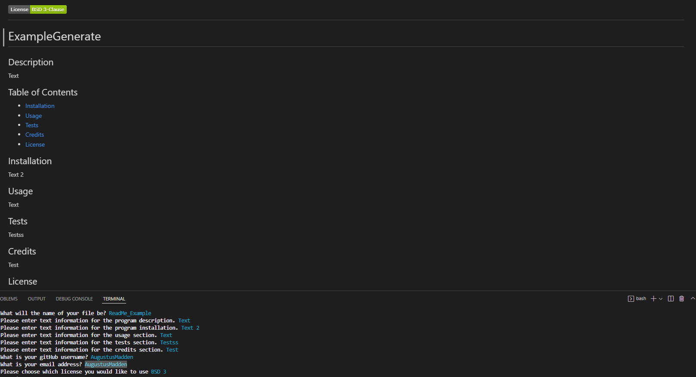

# 
  
  # readMe-Generator
  
  ## Description
  Automatic markdown file generator created to automate the process of creating ReadMe files for project use.
  
  ## Table of Contents
  - [Installation](#installation)
  - [Usage](#usage)
  - [Tests](#tests)
  - [Credits](#credits)
  - [License](#License)
  
  ## Installation
- Go to https://github.com/AugustusMadden/readMe-Generator
- Press the green code button on the top-right.
- Open Terminal/GitBash, and navigate to the space where you want the file to exist.
- Use the command `git clone <url>` and download.
- Open the folder in VS Code or your preferred coding software

  
  ## Usage
  Ativate via terminal or gitbash in your vscode. Initiate with the function 'node index'. Click on the image below to view a video walkthrough of the process.
  

    
  ## Credits
    Thanks to MDN and W3 for support documentation.
  
  ## License
  This project utilizes the Apache 2.0 License. For more information, please enquire at  [here](https://opensource.org/licenses/Apache-2.0).
  
  ## Questions
  If you have any questions or inquiries about this project, please email me at gusmadden@gmail.com, or contact me via my gitHub account at [https://github.com/AugustusMadden](https://github.com/AugustusMadden).
